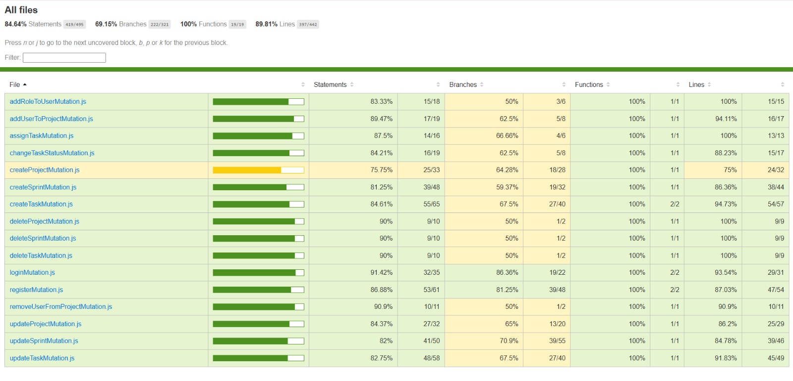
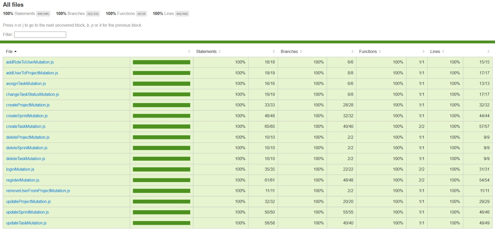
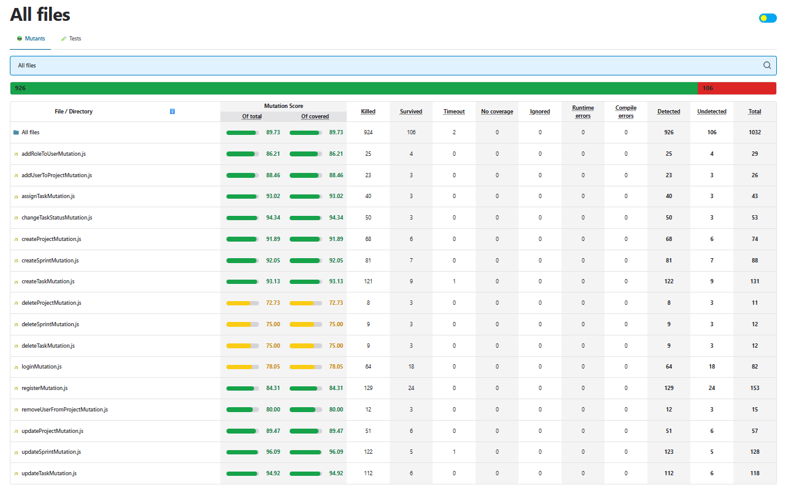

# Unit Testing &amp; Mutation Analysis in JavaScript

---
## 1. Introduction

**StudyBuddies** is a Node.js backend application that exposes a GraphQL API for a project-management platform. It supports full CRUD operations over users, projects, sprints, and tasks, secured with JWT authentication and Role-Based Access Control (RBAC).

This document describes the unit-testing and mutation-testing strategy applied to the application, covering test design with Equivalence Class Partitioning (ECP), Boundary Value Analysis (BVA), and Category Partitioning, as well as code coverage collected via Jest and mutation analysis via Stryker.

### 1.1 Tested Modules

Testing focuses on 16 GraphQL mutation resolvers grouped by domain:

| Domain | Mutations Tested | Test File |
|--------|-----------------|-----------|
| Users | `register`, `login`, `addRoleToUser` | `users_*Mutation.test.js` |
| Projects | `createProject`, `updateProject`, `deleteProject`, `addUserToProject`, `removeUserFromProject` | `projects_*Mutation.test.js` |
| Sprints | `createSprint`, `updateSprint`, `deleteSprint` | `sprints_*Mutation.test.js` |
| Tasks | `createTask`, `updateTask`, `deleteTask`, `assignTask`, `changeTaskStatus` | `tasks_*Mutation.test.js` |

**Total: 230 test cases across 16 test files.**

---
## 2. Environment and Configuration

### 2.1 Hardware Configuration

| Component | Specification |
|-----------|--------------|
| Processor | Intel Core i7 |
| RAM | 16 GB |
| Storage | SSD |
| Operating System | Windows 11 |
| Virtual Machine | **None** |

### 2.2 Software Configuration

| Software | Version | Purpose |
|----------|---------|---------|
| Node.js | v22.14.0 | JavaScript runtime |
| npm | 10.9.2 | Package manager |

### 2.3 Tool Versions (from `package.json`)

| Tool | Version | Role |
|------|---------|------|
| `jest` | 30.2.0 | Unit-test runner + coverage reporter |
| `@stryker-mutator/core` | 8.5.0 | Mutation-testing engine |
| `@stryker-mutator/jest-runner` | 8.5.0 | Stryker adapter for Jest |
| `graphql` | 16.11.0 | GraphQL runtime |
| `sequelize` | 6.37.7 | ORM for SQLite |
| `express` | 5.1.0 | HTTP server framework |

### 2.4 Project Setup and Commands

```bash
# Install all dependencies
npm install

# Run all tests
npm test

# Run tests with coverage report
npm run test:coverage

# Open coverage HTML report
start coverage\lcov-report\index.html

# Run Stryker mutation testing
npm run test:mutation

# Open mutation HTML report
start reports\mutation\mutation.html
```

---
## 3. Testing Strategies and Implementation

### 3.1. Equivalence Class Partitioning
Equivalence classes are documented per field and grouped by entity, with representative inputs and expected output domains.

#### 3.1.1. Users 

##### 1. Register (registerMutation)
   - email
       - emailValidClass (valid)
           - rule: formatValidAndLengthInRangeAndUnique
           - representativeInput: email="thisisanemail@studybuddies.com"
           - expectedOutputDomain: success
       - emailMissingClass (invalid)
           - rule: emailEmptyOrMissing
           - representativeInput: email=""
           - expectedOutputDomain: error "Email is required"
       - emailTooShortClass (invalid)
           - rule: emailLengthLessThan5
           - representativeInput: email="a@b."
           - expectedOutputDomain: error "Email must be between 5 and 254 characters"
       - emailTooLongClass (invalid)
           - rule: emailLengthGreaterThan254
           - representativeInput: email="a"*249 + "@ba.co"
           - expectedOutputDomain: error "Email must be between 5 and 254 characters"
       - emailInvalidFormatClass (invalid)
           - rule: emailDoesNotMatchRegex
           - representativeInput: email="invalid-email"
           - expectedOutputDomain: error "Email is invalid"
       - emailDuplicateClass (invalid)
           - rule: emailAlreadyInUse
           - representativeInput: email="dup@example.com" (pre-seeded)
           - expectedOutputDomain: error "Email already in use"

   - password
       - passwordValidClass (valid)
           - rule: lengthInRange
           - representativeInput: password="StudyBuddies_123"
           - expectedOutputDomain: success
       - passwordMissingClass (invalid)
           - rule: passwordEmptyOrMissing
           - representativeInput: password=""
           - expectedOutputDomain: error "Password is required"
       - passwordTooShortClass (invalid)
           - rule: passwordLengthLessThan8
           - representativeInput: password="abcdefg"
           - expectedOutputDomain: error "Password must be between 8 and 64 characters"
       - passwordTooLongClass (invalid)
           - rule: passwordLengthGreaterThan64
           - representativeInput: password="a"*65
           - expectedOutputDomain: error "Password must be between 8 and 64 characters"

   - username
       - usernameValidClass (valid)
           - rule: lengthInRangeAndUnique
           - representativeInput: username="user123"
           - expectedOutputDomain: success
       - usernameMissingClass (invalid)
           - rule: usernameEmptyOrMissing
           - representativeInput: username=""
           - expectedOutputDomain: error "Username is required"
       - usernameTooShortClass (invalid)
           - rule: usernameLengthLessThan3
           - representativeInput: username="ab"
           - expectedOutputDomain: error "Username must be between 3 and 30 characters"
       - usernameTooLongClass (invalid)
           - rule: usernameLengthGreaterThan30
           - representativeInput: username="a"*31
           - expectedOutputDomain: error "Username must be between 3 and 30 characters"
       - usernameDuplicateClass (invalid)
           - rule: usernameAlreadyInUse
           - representativeInput: username="dupuser" (pre-seeded)
           - expectedOutputDomain: error "Username already in use"

   - firstName
       - firstNameValidClass (valid)
           - rule: lengthInRange
           - representativeInput: firstName="Alice"
           - expectedOutputDomain: success
       - firstNameMissingClass (invalid)
           - rule: firstNameEmptyOrMissing
           - representativeInput: firstName=""
           - expectedOutputDomain: error "First name is required"
       - firstNameTooShortClass (invalid)
           - rule: firstNameLengthLessThan2
           - representativeInput: firstName="A"
           - expectedOutputDomain: error "First name must be between 2 and 50 characters"
       - firstNameTooLongClass (invalid)
           - rule: firstNameLengthGreaterThan50
           - representativeInput: firstName="a"*51
           - expectedOutputDomain: error "First name must be between 2 and 50 characters"

   - lastName
       - lastNameValidClass (valid)
           - rule: lengthInRange
           - representativeInput: lastName="Doe"
           - expectedOutputDomain: success
       - lastNameMissingClass (invalid)
           - rule: lastNameEmptyOrMissing
           - representativeInput: lastName=""
           - expectedOutputDomain: error "Last name is required"
       - lastNameTooShortClass (invalid)
           - rule: lastNameLengthLessThan2
           - representativeInput: lastName="B"
           - expectedOutputDomain: error "Last name must be between 2 and 50 characters"
       - lastNameTooLongClass (invalid)
           - rule: lastNameLengthGreaterThan50
           - representativeInput: lastName="a"*51
           - expectedOutputDomain: error "Last name must be between 2 and 50 characters"

##### 2. Login (loginMutation)

   - email
       - emailValidClass (valid)
           - rule: formatValidAndLengthInRange
           - representativeInput: email="thisisanemail@studybuddies.com"
           - expectedOutputDomain: successOrCredentialCheck
       - emailMissingClass (invalid)
           - rule: emailEmptyOrMissing
           - representativeInput: email=""
           - expectedOutputDomain: error "Email is required"
       - emailTooShortClass (invalid)
           - rule: emailLengthLessThan5
           - representativeInput: email="a@b."
           - expectedOutputDomain: error "Email must be between 5 and 254 characters"
       - emailTooLongClass (invalid)
           - rule: emailLengthGreaterThan254
           - representativeInput: email="a"*249 + "@ba.co"
           - expectedOutputDomain: error "Email must be between 5 and 254 characters"
       - emailInvalidFormatClass (invalid)
           - rule: emailDoesNotMatchRegex
           - representativeInput: email="invalid-email"
           - expectedOutputDomain: error "Email is invalid"

   - password
       - passwordValidClass (valid)
           - rule: lengthInRange
           - representativeInput: password="Login123!"
           - expectedOutputDomain: successOrCredentialCheck
       - passwordMissingClass (invalid)
           - rule: passwordEmptyOrMissing
           - representativeInput: password=""
           - expectedOutputDomain: error "Password is required"
       - passwordTooShortClass (invalid)
           - rule: passwordLengthLessThan8
           - representativeInput: password="abcdefg"
           - expectedOutputDomain: error "Password must be between 8 and 64 characters"
       - passwordTooLongClass (invalid)
           - rule: passwordLengthGreaterThan64
           - representativeInput: password="a"*65
           - expectedOutputDomain: error "Password must be between 8 and 64 characters"

   - accountState
       - userNotFoundClass (invalid)
           - rule: noUserForEmail
           - representativeInput: email="missing@studybuddies.com" (not seeded)
           - expectedOutputDomain: error "Invalid credentials"
       - passwordMismatchClass (invalid)
           - rule: userExistsButPasswordWrong
           - representativeInput: email="login@studybuddies.com", password="NotTheCorrectPassword!"
           - expectedOutputDomain: error "Invalid credentials"

3. Role Assignment (addRoleToUserMutation)

   - context
       - adminContextClass (valid)
           - rule: viewerHasAdminRole
           - representativeInput: roles=["Admin"]
           - expectedOutputDomain: success
       - nonAdminClass (invalid)
           - rule: viewerNotAdmin
           - representativeInput: roles=["Employee"]
           - expectedOutputDomain: error "Not authorized"

   - user
       - userExistsClass (valid)
           - rule: userExists
           - representativeInput: username="target"
           - expectedOutputDomain: success
       - userNotFoundClass (invalid)
           - rule: userDoesNotExist
           - representativeInput: username="missingUser"
           - expectedOutputDomain: error "User not found"

   - role
       - roleExistsClass (valid)
           - rule: roleExists
           - representativeInput: roleName="Manager"
           - expectedOutputDomain: success
       - roleNotFoundClass (invalid)
           - rule: roleDoesNotExist
           - representativeInput: roleName="Unknown"
           - expectedOutputDomain: error "Role not found"
       - roleAlreadyAssignedClass (invalid)
           - rule: userAlreadyHasRole
           - representativeInput: roleName="Employee" (already linked)
           - expectedOutputDomain: error "User already has this role"


#### 3.1.2. Projects

##### 1. Create (createProjectMutation)
   - context
       - adminManagerContextClass (valid)
           - rule: viewerHasAdminOrManagerRole
           - representativeInput: roles=["Admin"]
           - expectedOutputDomain: success
       - nonAdminManagerClass (invalid)
           - rule: viewerNotAdminOrManager
           - representativeInput: roles=["Employee"]
           - expectedOutputDomain: error "Not authorized"

   - name
       - nameValidClass (valid)
           - rule: lengthInRangeAndUnique
           - representativeInput: name="ProjectAlpha"
           - expectedOutputDomain: success
       - nameMissingClass (invalid)
           - rule: nameEmptyOrMissing
           - representativeInput: name=""
           - expectedOutputDomain: error "Project name is required"
       - nameTooShortClass (invalid)
           - rule: nameLengthLessThan3
           - representativeInput: name="ab"
           - expectedOutputDomain: error "Project name must be between 3 and 50 characters"
       - nameTooLongClass (invalid)
           - rule: nameLengthGreaterThan50
           - representativeInput: name="a"*51
           - expectedOutputDomain: error "Project name must be between 3 and 50 characters"
       - nameDuplicateClass (invalid)
           - rule: projectNameAlreadyExists
           - representativeInput: name="ProjectDup" (pre-seeded)
           - expectedOutputDomain: error "A project with this name already exists"

   - repositoryID
       - repositoryMissingClass (valid)
           - rule: repositoryIdNotProvided
           - representativeInput: repositoryID=null
           - expectedOutputDomain: success
       - repositoryIdNotFoundClass (invalid)
           - rule: repositoryIdDoesNotExist
           - representativeInput: repositoryID=999
           - expectedOutputDomain: error "Repository ID not found"
       - repositoryAlreadyAssignedClass (invalid)
           - rule: repositoryAlreadyLinkedToProject
           - representativeInput: repositoryID=1 (already linked)
           - expectedOutputDomain: error "This repository is already assigned to another project"

   - description
       - descriptionValidClass (valid)
           - rule: lengthInRangeOrMissing
           - representativeInput: description="Short desc"
           - expectedOutputDomain: success
       - descriptionTooLongClass (invalid)
           - rule: descriptionLengthGreaterThan500
           - representativeInput: description="a"*501
           - expectedOutputDomain: error "Description must be at most 500 characters"

##### 2. Update (updateProjectMutation)

   - context
       - adminManagerContextClass (valid)
           - rule: viewerHasAdminOrManagerRole
           - representativeInput: roles=["Admin"]
           - expectedOutputDomain: success
       - nonAdminManagerClass (invalid)
           - rule: viewerNotAdminOrManager
           - representativeInput: roles=["Employee"]
           - expectedOutputDomain: error "Not authorized"

   - projectID
       - projectExistsClass (valid)
           - rule: projectExists
           - representativeInput: projectID=1 (existing)
           - expectedOutputDomain: success
       - projectNotFoundClass (invalid)
           - rule: projectDoesNotExist
           - representativeInput: projectID=999
           - expectedOutputDomain: error "Project not found"

   - name
       - nameValidClass (valid)
           - rule: nameLengthInRange
           - representativeInput: name="NewName"
           - expectedOutputDomain: success
       - nameMissingClass (invalid)
           - rule: nameProvidedButEmpty
           - representativeInput: name=""
           - expectedOutputDomain: error "Project name is required"
       - nameTooShortClass (invalid)
           - rule: nameLengthLessThan3
           - representativeInput: name="ab"
           - expectedOutputDomain: error "Project name must be between 3 and 50 characters"
       - nameTooLongClass (invalid)
           - rule: nameLengthGreaterThan50
           - representativeInput: name="a"*51
           - expectedOutputDomain: error "Project name must be between 3 and 50 characters"

   - description
       - descriptionValidClass (valid)
           - rule: lengthInRangeOrMissing
           - representativeInput: description="Updated desc"
           - expectedOutputDomain: success
       - descriptionTooLongClass (invalid)
           - rule: descriptionLengthGreaterThan500
           - representativeInput: description="a"*501
           - expectedOutputDomain: error "Description must be at most 500 characters"

   - repositoryID
       - repositoryMissingClass (valid)
           - rule: repositoryIdNotProvided
           - representativeInput: repositoryID=null
           - expectedOutputDomain: success
       - repositoryIdNotFoundClass (invalid)
           - rule: repositoryIdDoesNotExist
           - representativeInput: repositoryID=999
           - expectedOutputDomain: error "Repository ID not found"

##### 3. Delete (deleteProjectMutation)

   - context
       - adminContextClass (valid)
           - rule: viewerHasAdminRole
           - representativeInput: roles=["Admin"]
           - expectedOutputDomain: success
       - nonAdminClass (invalid)
           - rule: viewerNotAdmin
           - representativeInput: roles=["Employee"]
           - expectedOutputDomain: error "Not authorized"

   - projectID
       - projectExistsClass (valid)
           - rule: projectExists
           - representativeInput: projectID=1 (existing)
           - expectedOutputDomain: success
       - projectNotFoundClass (invalid)
           - rule: projectDoesNotExist
           - representativeInput: projectID=999
           - expectedOutputDomain: error "Project not found"

##### 4. Add User to Project (addUserToProjectMutation)

   - context
       - adminManagerContextClass (valid)
           - rule: viewerHasAdminOrManagerRole
           - representativeInput: roles=["Admin"]
           - expectedOutputDomain: success
       - nonAdminManagerClass (invalid)
           - rule: viewerNotAdminOrManager
           - representativeInput: roles=["Employee"]
           - expectedOutputDomain: error "Not authorized"

   - projectID
       - projectExistsClass (valid)
           - rule: projectExists
           - representativeInput: projectID=1 (existing)
           - expectedOutputDomain: success
       - projectNotFoundClass (invalid)
           - rule: projectDoesNotExist
           - representativeInput: projectID=999
           - expectedOutputDomain: error "Project not found"

   - userID
       - userExistsClass (valid)
           - rule: userExists
           - representativeInput: userID=1 (existing)
           - expectedOutputDomain: success
       - userNotFoundClass (invalid)
           - rule: userDoesNotExist
           - representativeInput: userID=999
           - expectedOutputDomain: error "User not found"

   - linkState
       - notAssignedClass (valid)
           - rule: noExistingLink
           - representativeInput: (userID, projectID) not linked
           - expectedOutputDomain: success
       - alreadyAssignedClass (invalid)
           - rule: userAlreadyAssignedToProject
           - representativeInput: (userID, projectID) pre-linked
           - expectedOutputDomain: error "User is already assigned to this project"

##### 5. Remove User from Project (removeUserFromProjectMutation)

   - context
       - adminManagerContextClass (valid)
           - rule: viewerHasAdminOrManagerRole
           - representativeInput: roles=["Admin"]
           - expectedOutputDomain: success
       - nonAdminManagerClass (invalid)
           - rule: viewerNotAdminOrManager
           - representativeInput: roles=["Employee"]
           - expectedOutputDomain: error "Not authorized"

   - linkState
       - linkExistsClass (valid)
           - rule: userAssignedToProject
           - representativeInput: (userID, projectID) pre-linked
           - expectedOutputDomain: success
       - linkNotFoundClass (invalid)
           - rule: userNotAssignedToProjectOrInvalidIds
           - representativeInput: (userID, projectID) not linked
           - expectedOutputDomain: error "User was not assigned to this project or project/user not found"


#### 3.1.3. Sprints

##### 1. Create (createSprintMutation)

- context
    - adminManagerContextClass (valid)
        - rule: viewerHasAdminOrManagerRole
        - representativeInput: roles=["Manager"]
        - expectedOutputDomain: success
    - nonAdminManagerClass (invalid)
        - rule: viewerNotAdminOrManager
        - representativeInput: roles=["Employee"]
        - expectedOutputDomain: error "Not authorized"

- sprintNumber
    - sprintNumberValidClass (valid)
        - rule: integerGreaterOrEqual1
        - representativeInput: sprintNumber=1
        - expectedOutputDomain: success
    - sprintNumberMissingClass (invalid)
        - rule: sprintNumberEmptyOrMissing
        - representativeInput: sprintNumber=undefined
        - expectedOutputDomain: error "Sprint number is required"
    - sprintNumberZeroOrNegativeClass (invalid)
        - rule: sprintNumberLessThan1
        - representativeInput: sprintNumber=0
        - expectedOutputDomain: error "Sprint number must be greater than or equal to 1"
    - duplicateNumberInProjectClass (invalid)
        - rule: sprintNumberAlreadyExistsInTargetProject
        - representativeInput: sprintNumber=1 (already used)
        - expectedOutputDomain: error "Sprint number already exists in project"
    - nonIntegerSprintNumberClass (invalid)
        - rule: sprintNumberNotInteger
        - representativeInput: sprintNumber=2.5
        - expectedOutputDomain: error "Sprint number must be an integer"

- description
    - descriptionValidClass (valid)
        - rule: lengthInRangeOrMissing
        - representativeInput: description="Short description"
        - expectedOutputDomain: success
    - descriptionTooLongClass (invalid)
        - rule: descriptionLengthGreaterThan2000
        - representativeInput: description='a'*2001
        - expectedOutputDomain: error "Sprint description must be at most 2000 characters"

- startDate / endDate
    - validDatesClass (valid)
        - rule: bothDatesValidAndStartBeforeEnd
        - representativeInput: startDate="2026-01-01", endDate="2026-01-14"
        - expectedOutputDomain: success
    - invalidDateFormatClass (invalid)
        - rule: dateNotParsable
        - representativeInput: startDate="not-a-date"
        - expectedOutputDomain: error "Invalid date format"
    - missingStartOrEndClass (invalid)
        - rule: emptyStringProvidedForDate
        - representativeInput: startDate=""
        - expectedOutputDomain: error "Start date is required" (or "End date is required")
    - startAfterEndClass (invalid)
        - rule: startDateOnOrAfterEndDate
        - representativeInput: startDate="2026-01-15", endDate="2026-01-15"
        - expectedOutputDomain: error "Start date must be before end date"

- projectID
    - projectValidClass (valid)
        - rule: projectExistsOrNullAllowed
        - representativeInput: projectID=1
        - expectedOutputDomain: success
    - projectNotFoundClass (invalid)
        - rule: projectDoesNotExist
        - representativeInput: projectID=999
        - expectedOutputDomain: error "Project not found"

##### 2. Update (updateSprintMutation)
- context
    - adminManagerContextClass (valid)
        - rule: viewerHasAdminOrManagerRole
        - representativeInput: roles=["Manager"]
        - expectedOutputDomain: success
    - nonAdminManagerClass (invalid)
        - rule: viewerNotAdminOrManager
        - representativeInput: roles=["Employee"]
        - expectedOutputDomain: error "Not authorized"

- sprintNumber
    - sprintNumberValidClass (valid)
        - rule: integerGreaterOrEqual1
        - representativeInput: sprintNumber=1
        - expectedOutputDomain: success
    - sprintNumberMissingClass (invalid)
        - rule: sprintNumberEmptyOrMissing
        - representativeInput: sprintNumber=undefined
        - expectedOutputDomain: error "Sprint number is required"
    - sprintNumberZeroOrNegativeClass (invalid)
        - rule: sprintNumberLessThan1
        - representativeInput: sprintNumber=0
        - expectedOutputDomain: error "Sprint number must be greater than or equal to 1"
    - duplicateNumberInProjectClass (invalid)
        - rule: sprintNumberAlreadyExistsInTargetProject
        - representativeInput: sprintNumber=1 (already used)
        - expectedOutputDomain: error "Sprint number already exists in project"
    - nonIntegerSprintNumberClass (invalid)
        - rule: sprintNumberNotInteger
        - representativeInput: sprintNumber=2.5
        - expectedOutputDomain: error "Sprint number must be an integer"

- description
    - descriptionValidClass (valid)
        - rule: lengthInRangeOrMissing
        - representativeInput: description="Short description"
        - expectedOutputDomain: success
    - descriptionTooLongClass (invalid)
        - rule: descriptionLengthGreaterThan2000
        - representativeInput: description='a'*2001
        - expectedOutputDomain: error "Sprint description must be at most 2000 characters"

- startDate / endDate
    - validDatesClass (valid)
        - rule: bothDatesValidAndStartBeforeEnd
        - representativeInput: startDate="2026-01-01", endDate="2026-01-14"
        - expectedOutputDomain: success
    - invalidDateFormatClass (invalid)
        - rule: dateNotParsable
        - representativeInput: startDate="not-a-date"
        - expectedOutputDomain: error "Invalid date format"
    - missingStartOrEndClass (invalid)
        - rule: emptyStringProvidedForDate
        - representativeInput: startDate=""
        - expectedOutputDomain: error "Start date is required" (or "End date is required")
    - startAfterEndClass (invalid)
        - rule: startDateOnOrAfterEndDate
        - representativeInput: startDate="2026-01-15", endDate="2026-01-15"
        - expectedOutputDomain: error "Start date must be before end date"

- projectID
    - projectValidClass (valid)
        - rule: projectExistsOrNullAllowed
        - representativeInput: projectID=1
        - expectedOutputDomain: success
    - projectNullClass (valid)
        - rule: explicitNullProjectAllowed
        - representativeInput: sprintNumber=3, projectID=null
        - expectedOutputDomain: success
    - projectNotFoundClass (invalid)
        - rule: projectDoesNotExist
        - representativeInput: projectID=999
        - expectedOutputDomain: error "Project not found"

##### 3. Delete (deleteSprintMutation)
   - context
       - adminManagerContextClass (valid)
           - rule: viewerHasAdminOrManagerRole
           - representativeInput: roles=["Manager"]
           - expectedOutputDomain: success
       - nonAdminClass (invalid)
           - rule: viewerNotAdminOrManager
           - representativeInput: roles=["Employee"]
           - expectedOutputDomain: error "Not authorized"

   - sprintID
       - sprintExistsClass (valid)
           - rule: sprintExists
           - representativeInput: sprintID=1
           - expectedOutputDomain: success
       - sprintNotFoundClass (invalid)
           - rule: sprintDoesNotExist
           - representativeInput: sprintID=999
           - expectedOutputDomain: error "Sprint not found"


#### 3.1.4. Tasks

##### 1. Create (createTaskMutation)
- name
    - nameValidClass (valid)
        - rule: property present, trimmed non-empty, length <= 200
        - representativeInput: name="Task name"
        - expectedOutputDomain: success
    - nameMissingClass (invalid)
        - rule: property missing or trimmed empty
        - representativeInput: (no name property) or name="  "
        - expectedOutputDomain: error "Task name is required"
    - nameTooLongClass (invalid)
        - rule: length > 200
        - representativeInput: name of length 201
        - expectedOutputDomain: error "Task name must be at most 200 characters"

- description
    - descriptionValidClass (valid)
        - rule: property present, trimmed non-empty, length <= 2000
        - representativeInput: description="Task description"
        - expectedOutputDomain: success
    - descriptionMissingPropertyClass (invalid)
        - rule: property missing
        - representativeInput: (no description property)
        - expectedOutputDomain: error "Task description is required"
    - descriptionNullOrEmptyClass (invalid)
        - rule: property null or trimmed empty
        - representativeInput: description=null or description="   "
        - expectedOutputDomain: error "Task description is required"
    - descriptionTooLongClass (invalid)
        - rule: length > 2000
        - representativeInput: description of length 2001
        - expectedOutputDomain: error "Task description must be at most 2000 characters"

- status
    - statusValidClass (valid)
        - rule: inAllowedSet
        - representativeInput: status="Open"
        - expectedOutputDomain: success
    - statusInvalidClass (invalid)
        - rule: notInAllowedSet
        - representativeInput: status="NonExistentStatus"
        - expectedOutputDomain: error "Invalid status"

- assigneeUsername
    - assigneeValidClass (valid)
        - rule: userExistsOrNullAllowed
        - expectedOutputDomain: success
    - assigneeNotFoundClass (invalid)
        - rule: assigneeDoesNotExist
        - representativeInput: assigneeUsername="NonExistentUser"
        - expectedOutputDomain: error "Assignee not found"

- projectName
    - projectValidClass (valid)
        - rule: property present, trimmed non-empty, resolves to project
        - representativeInput: projectName="TaskProj1"
        - expectedOutputDomain: success
    - projectMissingPropertyClass (invalid)
        - rule: property missing or trimmed empty
        - representativeInput: (no projectName) or projectName="  "
        - expectedOutputDomain: error "Project name is required"
    - projectNullClass (invalid)
        - rule: property null
        - representativeInput: projectName=null
        - expectedOutputDomain: error "Project name is required"

- sprintNumber
    - sprintValidClass (valid)
        - rule: numeric, resolves to sprint by `number` within project context
        - representativeInput: sprintNumber=1
        - expectedOutputDomain: success
    - sprintNotFoundClass (invalid)
        - rule: sprint not found for given project
        - representativeInput: sprintNumber=9999
        - expectedOutputDomain: error "Sprint not found"
    - sprintNonNumericClass (invalid)
        - rule: non-numeric value
        - representativeInput: sprintNumber="abc"
        - expectedOutputDomain: error "Sprint not found"

##### 2. Update (updateTaskMutation)
- name
    - nameValidClass (valid)
        - rule: property present, trimmed non-empty, length <= 200
        - representativeInput: name="Task name"
        - expectedOutputDomain: success
    - nameMissingClass (invalid)
        - rule: property missing or trimmed empty
        - representativeInput: (no name property) or name="  "
        - expectedOutputDomain: error "Task name is required"
    - nameTooLongClass (invalid)
        - rule: length > 200
        - representativeInput: name of length 201
        - expectedOutputDomain: error "Task name must be at most 200 characters"

- description
    - descriptionValidClass (valid)
        - rule: property present, trimmed non-empty, length <= 2000
        - representativeInput: description="Task description"
        - expectedOutputDomain: success
    - descriptionMissingPropertyClass (invalid)
        - rule: property missing
        - representativeInput: (no description property)
        - expectedOutputDomain: error "Task description is required"
    - descriptionNullOrEmptyClass (invalid)
        - rule: property null or trimmed empty
        - representativeInput: description=null or description="   "
        - expectedOutputDomain: error "Task description is required"
    - descriptionTooLongClass (invalid)
        - rule: length > 2000
        - representativeInput: description of length 2001
        - expectedOutputDomain: error "Task description must be at most 2000 characters"

- status
    - statusValidClass (valid)
        - rule: inAllowedSet
        - representativeInput: status="Open"
        - expectedOutputDomain: success
    - statusInvalidClass (invalid)
        - rule: notInAllowedSet
        - representativeInput: status="NonExistentStatus"
        - expectedOutputDomain: error "Invalid status"

- assigneeUsername
    - assigneeValidClass (valid)
        - rule: userExistsOrNullAllowed
        - expectedOutputDomain: success
    - assigneeNotFoundClass (invalid)
        - rule: assigneeDoesNotExist
        - representativeInput: assigneeUsername="NonExistentUser"
        - expectedOutputDomain: error "Assignee not found"

- projectName
    - projectValidClass (valid)
        - rule: property present, trimmed non-empty, resolves to project
        - representativeInput: projectName="TaskProj1"
        - expectedOutputDomain: success
    - projectMissingPropertyClass (invalid)
        - rule: property missing or trimmed empty
        - representativeInput: (no projectName) or projectName="  "
        - expectedOutputDomain: error "Project name is required"
    - projectNullClass (invalid)
        - rule: property null
        - representativeInput: projectName=null
        - expectedOutputDomain: error "Project name is required"

- sprintNumber
    - sprintValidClass (valid)
        - rule: numeric, resolves to sprint by `number` within project context
        - representativeInput: sprintNumber=1
        - expectedOutputDomain: success
    - sprintNotFoundClass (invalid)
        - rule: sprint not found for given project
        - representativeInput: sprintNumber=9999
        - expectedOutputDomain: error "Sprint not found"
    - sprintNonNumericClass (invalid)
        - rule: non-numeric value
        - representativeInput: sprintNumber="abc"
        - expectedOutputDomain: error "Sprint not found"
    - sprintNumberNullClass (valid)
        - rule: property present with explicit null → clears sprint
        - representativeInput: sprintNumber=null
        - expectedOutputDomain: success

##### 3. Delete (deleteTaskMutation)
   - context
       - adminManagerContextClass (valid)
           - rule: viewerHasAdminOrManagerRole
           - representativeInput: roles=["Manager"]
           - expectedOutputDomain: success
       - nonAllowedUserClass (invalid)
           - rule: viewerNotAllowedToDelete
           - representativeInput: roles=["Employee"]
           - expectedOutputDomain: error "Not authorized"

   - taskID
       - taskExistsClass (valid)
           - rule: taskExists
           - representativeInput: taskID=1
           - expectedOutputDomain: success
       - taskNotFoundClass (invalid)
           - rule: taskDoesNotExist
           - representativeInput: taskID=99999
           - expectedOutputDomain: error "Task not found"

##### 4. Assign Task (assignTaskMutation)
- assigneeUsername
    - assigneeValidClass (valid)
        - rule: property present, trimmed non-empty, resolves to user
        - representativeInput: assigneeUsername="assignee"
        - expectedOutputDomain: success
    - assigneeMissingOrEmptyClass (invalid)
        - rule: property missing or trimmed empty
        - representativeInput: (no assigneeUsername) or assigneeUsername=""
        - expectedOutputDomain: error "Assignee is required"
    - assigneeNotFoundClass (invalid)
        - rule: username does not resolve
        - representativeInput: assigneeUsername="NonExistentUser"
        - expectedOutputDomain: error "Assignee not found"


##### 5. Change task status (changeTaskStatusMutation)
- status
    - statusValidClass (valid)
        - rule: property present (hasOwnProperty), non-null, value in allowed set
        - representativeInput: status="InProgress"
        - expectedOutputDomain: success
    - statusMissingPropertyClass (invalid)
        - rule: property missing
        - representativeInput: (no status property)
        - expectedOutputDomain: error "Status is required"
    - statusNullClass (invalid)
        - rule: property present but null
        - representativeInput: status=null
        - expectedOutputDomain: error "Status is required"
    - statusInvalidClass (invalid)
        - rule: value not in allowed set
        - representativeInput: status="Bad"
        - expectedOutputDomain: error "Invalid status"

    


### 3.2. Boundary Value Analysis (BVA)
#### 3.2.1. Users
##### 1. Register (registerMutation) boundaries
- email length: 4 (invalid) / 5 (valid) and 254 (valid) / 255 (invalid)
- password length: 7 (invalid) / 8 (valid) and 64 (valid) / 65 (invalid)
- username length: 2 (invalid) / 3 (valid) and 30 (valid) / 31 (invalid)
- firstName length: 1 (invalid) / 2 (valid) and 50 (valid) / 51 (invalid)
- lastName length: 1 (invalid) / 2 (valid) and 50 (valid) / 51 (invalid)
##### 2. Login (loginMutation) boundaries
- email length: 4 (invalid) / 5 (valid) and 254 (valid) / 255 (invalid)
- password length: 7 (invalid) / 8 (valid) and 64 (valid) / 65 (invalid)

#### 3.2.2. Projects
##### 1. Create (createProjectMutation) boundaries
- name length: 2 (invalid) / 3 (valid) and 50 (valid) / 51 (invalid)
- description length: 500 (valid) / 501 (invalid)
- repositoryID existence: existingId (valid) / nonExistingId (invalid)
##### 2. Update (updateProjectMutation) boundaries
- name length: 2 (invalid) / 3 (valid) and 50 (valid) / 51 (invalid)
- description length: 500 (valid) / 501 (invalid)
- projectID existence: existingId (valid) / missingId (invalid)
- repositoryID existence: existingId (valid) / nonExistingId (invalid)

#### 3.2.3. Sprints
##### 1. Create (createSprintMutation) boundaries
- sprintNumber: 0 (invalid) / 1 (valid)
- description length: 2000 (valid) / 2001 (invalid)
- projectID existence: existingId (valid) / nonExistingId (invalid)
- start date < end date
##### 2. Update (updateSprintMutation) boundaries
- sprintNumber: 0 (invalid) / 1 (valid)
- description length: 2000 (valid) / 2001 (invalid)
- projectID existence: existingId (valid) / nonExistingId (invalid)
- start date < end date

#### 3.2.4. Tasks
##### 1. Create (createTaskMutation) boundaries
- name length: 200 (valid) / 201 (invalid)
- description length: 2000 (valid) / 2001 (invalid)
- status: 'Open', 'In Progress', 'Done', 'Closed' (valid) / 'Invalid' (invalid)
- assigneeUsername existence: existingUsername (valid) / nonExistingUsername (invalid)
- projectName existence: existingName (valid) / nonExistingName (invalid)
- sprintNumber existence: existingId (valid) / nonExistingId (invalid)

##### 2. Update (updateTaskMutation) boundaries
- name length: 200 (valid) / 201 (invalid)
- description length: 2000 (valid) / 2001 (invalid)
- status: 'Open', 'In Progress', 'Done', 'Closed' (valid) / 'Invalid' (invalid)
- assigneeUsername existence: existingUsername (valid) / nonExistingUsername (invalid)
- projectName existence: existingName (valid) / nonExistingName (invalid)
- sprintNumber existence: existingId (valid) / nonExistingId (invalid)


### 3.3. Category Partitioning

Note: test cases are derived by combining exactly one choice from each category. One-valid-at-a-time means one category is invalid while all others are valid.

#### 3.3.1. Users

##### 1. Register (registerMutation)
- prunedCategories
    - none (all fields validated separately)
- categories
    - emailCategory
    - passwordCategory
    - usernameCategory
    - firstNameCategory
    - lastNameCategory
    - uniquenessCategory
- representativeValues
    - emailCategory: valid="thisisanemail@studybuddies.com", missing="", tooShort="a@b.", tooLong="a"*249 + "@ba.co", invalidFormat="invalid-email", duplicate="dup@example.com"
    - passwordCategory: valid="StudyBuddies_123", missing="", tooShort="abcdefg", tooLong="a"*65
    - usernameCategory: valid="user123", missing="", tooShort="ab", tooLong="a"*31, duplicate="dupuser"
    - firstNameCategory: valid="Jenna", missing="", tooShort="A", tooLong="a"*51
    - lastNameCategory: valid="Doe", missing="", tooShort="D", tooLong="a"*51
    - uniquenessCategory: emailUnique/usernameUnique (valid), emailDuplicate="duplicate@studybuddies.com", usernameDuplicate="usernameDup"
- oneValidAtATime
    - registerAllValid, registerEmailMissing, registerEmailTooShort, registerEmailTooLong, registerEmailInvalidFormat, registerEmailDuplicate, registerPasswordMissing, registerPasswordTooShort, registerPasswordTooLong, registerUsernameMissing, registerUsernameTooShort, registerUsernameTooLong, registerUsernameDuplicate, registerFirstNameMissing, registerFirstNameTooShort, registerFirstNameTooLong, registerLastNameMissing, registerLastNameTooShort, registerLastNameTooLong

##### 2. Login (loginMutation)
- prunedCategories
    - none
- categories
    - emailCategory
    - passwordCategory
    - accountStateCategory
- representativeValues
    - emailCategory: valid="thisisanemail@studybuddies.com", missing="", tooShort="a@b.", tooLong="a"*249 + "@ba.co", invalidFormat="invalid-email"
    - passwordCategory: valid="StudyBuddies_123", missing="", tooShort="abcdefg", tooLong="a"*65
    - accountStateCategory: userNotFound="missing@studybuddies.com", passwordMismatch=("login@studybuddies.com", "NotTheCorrectPassword!")
- oneValidAtATime
    - loginAllValid, loginEmailMissing, loginEmailTooShort, loginEmailTooLong, loginEmailInvalidFormat, loginPasswordMissing, loginPasswordTooShort, loginPasswordTooLong, loginUserNotFound, loginPasswordMismatch

##### 3. Role Assignment (addRoleToUserMutation)
- prunedCategories
    - none
- categories
    - contextCategory
    - userCategory
    - roleCategory
- representativeValues
    - contextCategory: admin=["Admin"], nonAdmin=["Employee"]
    - userCategory: exists="target", notFound="missingUser"
    - roleCategory: exists="Manager", notFound="Unknown", alreadyAssigned="Employee"
- oneValidAtATime
    - roleAssignmentAllValid, roleAssignmentNonAdmin, roleAssignmentUserNotFound, roleAssignmentRoleNotFound, roleAssignmentRoleAlreadyAssigned

#### 3.3.2. Projects
##### 1. Create (createProjectMutation)
- prunedCategories
    - descriptionCategory: validAndMissingMerged (both map to success)
    - repositoryCategory: repositoryMissingMergedWithRepositoryValid (both map to success)
- categories
    - contextCategory
    - nameCategory
    - repositoryCategory
    - descriptionCategory
- representativeValues
    - contextCategory: adminOrManager=["Admin"], nonAdmin=["Employee"]
    - nameCategory: valid="JavascriptTesting", missing="", tooShort="jt", tooLong="a"*51, duplicate="DuplicateName"
    - repositoryCategory: missingOrValid=null, notFound=999, assigned=1
    - descriptionCategory: valid="Short description", tooLong="a"*501
- oneValidAtATime
    - createProjectAllValid, createProjectNonAdmin, createProjectNameMissing, createProjectNameTooShort, createProjectNameTooLong, createProjectNameDuplicate, createProjectRepositoryNotFound, createProjectRepositoryAssigned, createProjectDescriptionTooLong

##### 2. Update (updateProjectMutation)
- prunedCategories
    - descriptionCategory: validAndMissingMerged (both map to success)
    - repositoryCategory: repositoryMissingMergedWithRepositoryValid (both map to success)
- categories
    - contextCategory
    - projectIdCategory
    - nameCategory
    - descriptionCategory
    - repositoryCategory
- representativeValues
    - contextCategory: adminOrManager=["Admin"], nonAdmin=["Employee"]
    - projectIdCategory: exists=1, notFound=999
    - nameCategory: valid="NewName", missing="", tooShort="nn", tooLong="a"*51
    - descriptionCategory: valid="Updated description", tooLong="a"*501
    - repositoryCategory: missingOrValid=null, notFound=999
- oneValidAtATime
    - updateProjectAllValid, updateProjectNonAdmin, updateProjectNotFound, updateProjectNameMissing, updateProjectNameTooShort, updateProjectNameTooLong, updateProjectDescriptionTooLong, updateProjectRepositoryNotFound

##### 3. Delete (deleteProjectMutation)
- prunedCategories
    - none
- categories
    - contextCategory
    - projectIdCategory
- representativeValues
    - contextCategory: admin=["Admin"], nonAdmin=["Employee"]
    - projectIdCategory: exists=1, notFound=999
- oneValidAtATime
    - deleteProjectAllValid, deleteProjectNonAdmin, deleteProjectNotFound

##### 4. Add User to Project (addUserToProjectMutation)
- prunedCategories
    - none
- categories
    - contextCategory
    - projectIdCategory
    - userIdCategory
    - linkStateCategory
- representativeValues
    - contextCategory: adminOrManager=["Admin"], nonAdmin=["Employee"]
    - projectIdCategory: exists=1, notFound=999
    - userIdCategory: exists=1, notFound=999
    - linkStateCategory: notAssigned="(userID, projectID) not linked", alreadyAssigned="(userID, projectID) pre-linked"
- oneValidAtATime
    - addUserToProjectAllValid, addUserToProjectNonAdmin, addUserToProjectProjectNotFound, addUserToProjectUserNotFound, addUserToProjectAlreadyAssigned

##### 5. Remove User from Project (removeUserFromProjectMutation)
- prunedCategories
    - none
- categories
    - contextCategory
    - linkStateCategory
- representativeValues
    - contextCategory: adminOrManager=["Admin"], nonAdmin=["Employee"]
    - linkStateCategory: linkExists="(userID, projectID) pre-linked", linkNotFound="(userID, projectID) not linked"
- oneValidAtATime
    - removeUserFromProjectAllValid, removeUserFromProjectNonAdmin, removeUserFromProjectLinkNotFound

#### 3.3.3. Sprints

##### 1. Create (createSprintMutation)
- prunedCategories
- descriptionCategory: validAndMissingMerged (both map to success)
- startEndDateCategory: validAndMissingMerged (both map to success when provided correctly)
- categories
- contextCategory
- sprintNumberCategory
- descriptionCategory
- startDateCategory
- endDateCategory
- projectIDCategory
- representativeValues
- contextCategory: adminOrManager=["Manager"], nonAdmin=["Employee"]
- sprintNumberCategory: valid=1, missing=undefined, zeroOrNegative=0, duplicateInProject=1 (already exists), nonInteger=2.5
- descriptionCategory: valid="Short description", tooLong='a'*2001, missing=''
- startDateCategory: valid="2026-01-01", invalidFormat="not-a-date", missing=''
- endDateCategory: valid="2026-01-14", invalidFormat="not-a-date", missing=''
- projectIDCategory: valid=1, missing=null, notFound=999
- oneValidAtATime
- createSprintAllValid, createSprintNonAdmin, createSprintNumberMissing, createSprintNumberZeroOrNegative, createSprintNumberDuplicate, createSprintNumberNonInteger, createSprintDescriptionTooLong, createSprintStartInvalidFormat, createSprintEndInvalidFormat, createSprintProjectNotFound

##### 2. Update (updateSprintMutation)
- prunedCategories
    - descriptionCategory: validAndMissingMerged
    - startEndDateCategory: validAndMissingMerged
- categories
    - contextCategory
    - sprintIDCategory
    - sprintNumberCategory
    - descriptionCategory
    - startDateCategory
    - endDateCategory
    - projectIDCategory
- representativeValues
    - contextCategory: adminOrManager=["Manager"], nonAdmin=["Employee"]
    - sprintIDCategory: exists=1, notFound=999
    - sprintNumberCategory: valid=1, missing=undefined, duplicateInProject=1, nonInteger=2.5
    - descriptionCategory: valid="Short description", tooLong='a'*2001, missing=''
    - startDateCategory: valid="2026-01-01", invalidFormat="not-a-date", missing=''
    - endDateCategory: valid="2026-01-14", invalidFormat="not-a-date", missing=''
    - projectIDCategory: valid=1, nullAllowed=null, notFound=999
- oneValidAtATime
    - updateSprintAllValid, updateSprintNonAdmin, updateSprintNotFound, updateSprintNumberDuplicate, updateSprintNumberNonInteger, updateSprintDescriptionTooLong, updateSprintStartInvalidFormat, updateSprintEndInvalidFormat, updateSprintProjectNotFound

##### 3. Delete (deleteSprintMutation)
- prunedCategories
    - none
- categories
    - contextCategory
    - sprintIDCategory
- representativeValues
    - contextCategory: adminOrManager=["Manager"], nonAdmin=["Employee"]
    - sprintIDCategory: exists=1, notFound=999
- oneValidAtATime
    - deleteSprintAllValid, deleteSprintNonAdmin, deleteSprintNotFound

#### 3.3.4. Tasks

##### 1. Create (createTaskMutation)
- prunedCategories
    - descriptionCategory: validAndMissingMerged
    - assigneeCategory: nullAndValidMerged
- categories
    - contextCategory
    - nameCategory
    - descriptionCategory
    - statusCategory
    - assigneeUsernameCategory
    - projectNameCategory
    - sprintNumberCategory
- representativeValues
    - contextCategory: adminManagerOrUser=["Manager"], other=["Employee"]
    - nameCategory: valid="Task name", missing=undefined, tooLong='N'*201
    - descriptionCategory: valid="Task description", missing=undefined, tooLong='D'*2001
    - statusCategory: valid='Open'/'In Progress'/'Done'/'Closed', invalid='Invalid'
    - assigneeUsernameCategory: valid='alice', missing=null, notFound='NonExistentUser'
    - projectNameCategory: valid='TaskProj', missing=undefined, notFound='NonExistentProject'
    - sprintNumberCategory: valid=1, missing=undefined, notFound=9999, nonNumeric='abc'
- oneValidAtATime
    - createTaskAllValid, createTaskNameMissing, createTaskNameTooLong, createTaskDescriptionTooLong, createTaskStatusInvalid, createTaskAssigneeNotFound, createTaskProjectNotFound, createTaskSprintNotFound, createTaskSprintNonNumeric

##### 2. Update (updateTaskMutation)
- prunedCategories
    - descriptionCategory: validAndMissingMerged
    - assigneeCategory: nullAndValidMerged
- categories
    - contextCategory
    - taskIDCategory
    - nameCategory
    - descriptionCategory
    - statusCategory
    - assigneeUsernameCategory
    - projectNameCategory
    - sprintNumberCategory
- representativeValues
    - contextCategory: adminManagerOrUser=["Manager"], other=["Employee"]
    - taskIDCategory: exists=1, notFound=99999
    - nameCategory: valid='Task name', missing=undefined, tooLong='N'*201
    - descriptionCategory: valid='Task description', missing=undefined, tooLong='D'*2001
    - statusCategory: valid='Open'/'In Progress'/'Done'/'Closed', invalid='Invalid'
    - assigneeUsernameCategory: valid='alice', missing=null, notFound='NonExistentUser'
    - projectNameCategory: valid='TaskProj', missing=undefined, notFound='NonExistentProject'
    - sprintNumberCategory: valid=1, missing=undefined, notFound=9999, nonNumeric='abc'
- oneValidAtATime
    - updateTaskAllValid, updateTaskNotFound, updateTaskNameMissing, updateTaskNameTooLong, updateTaskDescriptionTooLong, updateTaskStatusInvalid, updateTaskAssigneeNotFound, updateTaskProjectNotFound, updateTaskSprintNotFound, updateTaskSprintNonNumeric

##### 3. Delete (deleteTaskMutation)
- prunedCategories
    - none
- categories
    - contextCategory
    - taskIDCategory
- representativeValues
    - contextCategory: adminOrManager=["Manager"], nonAllowed=["Employee"]
    - taskIDCategory: exists=1, notFound=99999
- oneValidAtATime
    - deleteTaskAllValid, deleteTaskNonAdmin, deleteTaskNotFound

##### 4. Assign Task to Sprint (assignTaskToSprintMutation)
- prunedCategories
    - none
- categories
    - contextCategory
    - taskIDCategory
    - assigneeUsernameCategory
- representativeValues
    - contextCategory: adminManagerOrUser=["Manager"], other=["Employee"]
    - taskIDCategory: exists=1, notFound=99999
    - assigneeUsernameCategory: valid='alice', missing='', notFound='NonExistentUser'
- oneValidAtATime
    - assignTaskAllValid, assignTaskTaskNotFound, assignTaskAssigneeMissing, assignTaskAssigneeNotFound, assignTaskUnauthorized

##### 5. Change task status (changeTaskStatusMutation)
- prunedCategories
    - none
- categories
    - contextCategory
    - taskIDCategory
    - statusCategory
- representativeValues
    - contextCategory: adminManagerOrUser=["Manager"]
    - taskIDCategory: exists=1, notFound=99999
    - statusCategory: valid='Open'/'In Progress'/'Done'/'Closed', missingProperty=(input lacks `status`), nullStatus=null, invalid='Invalid'
- oneValidAtATime
    - changeTaskStatusAllValid, changeTaskStatusTaskNotFound, changeTaskStatusMissingStatusProp, changeTaskStatusNullStatus, changeTaskStatusInvalidStatus, changeTaskStatusUnauthorized


### 3.4 Control Flow and Coverage Metrics
We used Jest's coverage option (--coverage) to instrument the code and produce a summary plus an HTML report under ./coverage.
The report shows per-file and total percentages for statements, branches, functions, and lines, and highlights uncovered lines.
Coverage summary (./coverage): Statements 100% (219/219), Branches 100% (136/136), Functions 100% (10/10), Lines 100% (198/198).

#### 3.4.1 Statement Coverage 
Definition: percentage of executable statements that run at least once.
How we used it: we ran Jest with coverage (npm run test:coverage) and ensured each mutation has tests that execute the success path and each validation/error statement, reaching 100% statements.

#### 3.4.2 Decision (Branch) Coverage
Definition: percentage of decision outcomes (true/false for if/else and ternary branches) that are both taken.
How we used it: tests include valid and invalid inputs plus authorization checks so each decision point is exercised in both directions; branches are at 100%.

#### 3.4.3 Condition Coverage
Definition: percentage of individual boolean conditions inside a decision that evaluate to both true and false.
How we used it: one-valid-at-a-time cases target each condition separately (length, format, uniqueness, existence), ensuring each sub-condition flips at least once; functions and lines are at 100%.

#### 3.4.4 Independent Paths Analysis
Definition: a minimal set of distinct execution paths that collectively cover all decision outcomes.
How we used it: for each mutation we include a success path and one path per unique error/exit, aligned with the category partitioning list.
Path diagrams are documented in _diagrams.


## 4. Mutation Testing 

### 4.1 Mutation Generator Setup and Execution
We use Stryker as the mutation generator, configured in stryker.conf.js and executed via npm run test:mutation.
Targets include Users/Projects/Sprints/Tasks mutations and queries plus authorization and JWT middleware.
Configuration highlights:
- Mutate patterns: graphql/mutations/**/*user*.js, graphql/mutations/**/*project*.js, graphql/queries/**/*user*.js, graphql/queries/**/*project*.js, utils/authorize.js, middlewares/jwtMiddleware.js
- Test runner: Jest (custom project), using jest.config.js
- Coverage analysis: off (faster, uses existing tests)
- Reporters: clear-text and HTML (output under reports/mutation/html)

---

## 5. Results

### 5.1 Path Diagrams

Independent path diagrams are stored in the `_diagrams/` folder.

### 5.2 Coverage Results — Test Writing Progression

The test suite was built incrementally in three stages, each with a clear goal derived from the previous stage's results.

| Stage | Tests Written | Statements | Branches | Functions | Lines |
|-------|--------------|------------|----------|-----------|-------|
| **Stage 1**: Initial tests | 47 | 84.64% | 69.15% | 100% | 89.81% |
| **Stage 2**: After reaching 100% coverage | 197 | 100% | 100% | 100% | 100% |
| **Stage 3**: After killing remaining mutants | 230 | 100% | 100% | 100% | 100% |

**Stage 1: Initial test writing:**
The first tests were written following the ECP and Category Partitioning strategies, covering the happy path and the most representative error cases per module. Running coverage at this stage revealed that many validation branches (boundary conditions, structural paths) were not yet exercised.



**Stage 2: Reaching 100% code coverage:**
Based on the coverage report, the uncovered branches were identified and additional tests were written for them. After this stage, all statements, branches, functions, and lines reached 100%. However, running Stryker revealed that a subset of mutants still survived.



**Stage 3: Killing surviving mutants:**
Tests were added, for example, for the structure of Sequelize query calls (`capturesIncludes`, `whereClauses`). These additions did not change coverage (already 100%) but ensured every surviving mutant was killed.


### 5.5 Mutation Testing Results

| Stage | Total Mutants | Killed | Survived | Timed Out |
|-------|--------------|--------|----------|-----------|
| Stage 1: Initial tests | — | — | — | — | — |
| Stage 2: 100% coverage | 1032 | 924 | 106 | 2 |
| Stage 3: Full kill | TBD | TBD | TBD | TBD |



---

## 6. Interpretations

### 6.1 Code Coverage Metrics

**Statement coverage** at 100% confirms that every executable statement in the 16 mutation resolvers was reached by at least one test.

**Branch coverage** at 100% ensures both outcomes of every `if`, ternary, and logical operator were exercised. In a validation-heavy GraphQL resolver this is particularly meaningful: each guard clause was tested both when the condition is true  and false.

**Function coverage** at 100% is expected since each file exports a single resolver function.

**Line coverage** closely mirrors statement coverage and is reported at 100%.

### 6.2 Mutation Testing Interpretation


### 6.3 Tool Comparison

| Criterion | Jest | Stryker Mutation Testing |
|-----------|---------------------|--------------------------|
| **What it measures** | Were lines/branches executed? | Do tests detect injected bugs? |
| **False sense of security** | Yes: executing a line ≠ checking its result | No: a mutant is killed only when a test fails |
| **Execution speed** | Fast (seconds) | Slow (minutes to hours) |
| **Output granularity** | Per file / per line | Per mutant / per operator |
| **When 100% is meaningful** | Baseline quality gate | Indicates strong assertions |
| **Complementary use** | Find untested code paths | Find weakly-asserted code paths |

**Key insight:** 100% code coverage is a necessary but not sufficient condition for test suite quality. Mutation testing provides the complementary guarantee that the assertions are meaningful, not just present.


## 7. AI Report 

[The project AI Report can be accesed by clicking this reference.](./ai_report.md)

## 8. Bibliography

* JavaScript unit testing frameworks in 2024: A comparison, Mohsen Taleb (https://raygun.com/blog/javascript-unit-testing-frameworks/, last accessed March 2026)
* Jest Official Documentation Website (https://jestjs.io, last accessed April 2026)
* Stryker Official Documentation Website (https://stryker-mutator.io, last accessed April 2026)
* Anthropic Claude (https://claude.ai, last accessed May 2026)
* GitHub Copilot (https://github.com/copilot, last accessed May 2026)
* Google Gemini (https://gemini.google.com, last accessed May 2026)

Note: Anthropic Claude, GitHub Copilot, and Google Gemini, were used in this project for: code synthesis, code writing, test writing (see [AI Report](./ai_report.md)), documentation structure and wording.