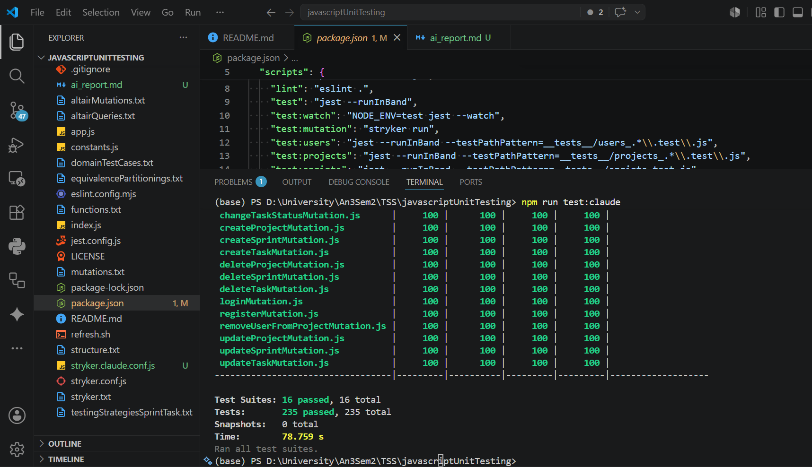
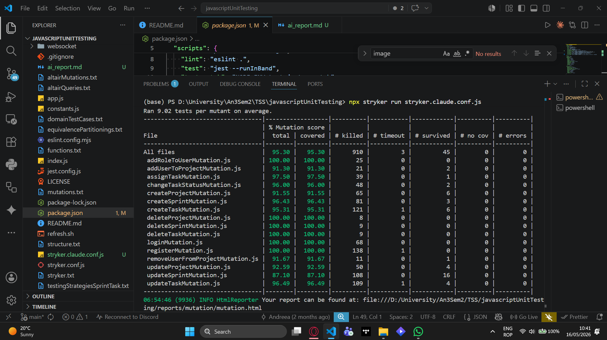

# AI-Assisted Software Testing: Comparing Manually Written and AI-Generated Test Suites

**Course:** Software Systems Testing
**Date:** May 2026

---

## Table of Contents

1. [Introduction](#1-introduction)
2. [Methodology and Tooling](#2-methodology-and-tooling)
3. [Comparative Analysis: Manual vs. AI-Generated Tests](#3-comparative-analysis-manual-vs-ai-generated-tests)
4. [Practical Application and Execution](#4-practical-application-and-execution)
5. [Conclusion](#5-conclusion)
6. [References](#6-references)

---

## 1. Introduction

Large Language Models (LLMs) are becoming a common part of software development workflows. Tools like GitHub Copilot, ChatGPT, and Anthropic's Claude can generate code, write documentation, and assist with debugging. One area where they are increasingly used is automated test generation, since testing involves a lot of repetitive, pattern-based code that is well suited to AI generation.

Research has confirmed both the potential and the limitations of these tools. Chen et al. (2021) showed that LLMs trained on code can solve a meaningful portion of programming tasks from plain-language descriptions. Dakhel et al. (2023) evaluated GitHub Copilot specifically and found that while it speeds up code writing significantly, the output still requires human review to catch correctness issues. In the area of testing, Lemieux et al. (2023) demonstrated that LLMs can help test generation tools break through coverage plateaus that purely algorithmic approaches cannot escape. Kang et al. (2023) showed that LLMs can even reproduce bugs from issue descriptions, though they also noted the risk of generating tests that pass for the wrong reasons.

This report evaluates how an AI assistant, specifically Anthropic's Claude, performed when asked to generate a Jest test suite for a real Node.js GraphQL API. The goal is to compare that AI-generated suite against a manually written one, focusing on coverage quality, assertion strength, and mutation score.

---

## 2. Methodology and Tooling

### 2.1 The Application Under Test

The project is called *Study Buddies*, a Node.js backend built with Express, GraphQL, and Sequelize (using an SQLite database). It manages users, projects, sprints, and tasks. The business logic lives inside GraphQL resolvers, where each mutation handles validation, database access, and authorization.

The mutations covered by the test suite are organized into four groups:

- **Users:** `loginMutation`, `registerMutation`, `addRoleToUserMutation`
- **Projects:** `createProjectMutation`, `updateProjectMutation`, `deleteProjectMutation`, `addUserToProjectMutation`, `removeUserFromProjectMutation`
- **Sprints:** `createSprintMutation`, `updateSprintMutation`, `deleteSprintMutation`
- **Tasks:** `createTaskMutation`, `updateTaskMutation`, `deleteTaskMutation`, `assignTaskMutation`, `changeTaskStatusMutation`

Each group has a dedicated test file inside the `__tests__/` folder, following a consistent naming convention (e.g., `users_registerMutation.test.js`, `tasks_createTaskMutation.test.js`).

### 2.2 Test Infrastructure

The project uses **Jest** (v30) as the testing framework. A shared `setup.js` file runs `sequelize.sync({ force: true })` before every test, wiping and recreating the SQLite database to ensure complete isolation between tests. A `helpers.js` module provides factory functions for creating users, projects, sprints, and tasks, as well as an `executeGraphql` wrapper that calls resolvers directly through the schema without needing an HTTP server.

```js
// Key helpers available to all tests
executeGraphql({ source, variableValues, contextUser })
createUser({ email, password, username })
createUserWithRoles({ email, password, username, roles })
createProject({ name, description, repositoryID })
createSprint({ sprintNumber, description, startDate, endDate, projectID })
createTask({ name, description, status, reporterUserID, projectID })
buildContextUser(user)
```

### 2.3 Mutation Testing

**Stryker Mutator** (v8.5) was used to measure test suite quality. Stryker injects small faults into the source code one at a time (for example, changing `>` to `>=`, or removing a `throw` statement) and checks whether the tests catch the change. A mutant that no test catches is called a *survived* mutant and represents a gap in the suite. The configuration used `coverageAnalysis: 'perTest'`, which means Stryker only runs the specific tests that cover each mutant, making the process faster and more precise.

---

## 3. Comparative Analysis: Manual vs. AI-Generated Tests

### 3.1 Speed of Writing

The biggest practical advantage of using AI for test generation is speed. Every test in this project follows the same pattern: set up database entities using helpers, call a GraphQL mutation, and assert on the result. Writing 16 test files with 8 to 15 tests each by hand is slow and repetitive work. An AI assistant, given the resolver source code and the helper file, can produce a full first draft for an entire test file in seconds.

This matches what Dakhel et al. (2023) observed with GitHub Copilot: the tool's main contribution is reducing the time to a working first draft, especially for repetitive code.

### 3.2 Edge Case Coverage

AI tools are generally consistent at applying standard testing techniques like boundary value testing. When given a validator that checks string length between a minimum and maximum, the AI will reliably generate tests for values that are too short, too long, exactly at the limit, empty, and null.

Where AI tools tend to fall short is with domain-specific logic that is not obvious from the code alone. For example, the `createSprintMutation` checks that sprint dates do not overlap with existing sprints in the same project. This is a critical business rule, but an AI might not generate a test for it unless it is explicitly prompted to do so, or unless the validation logic in the resolver is clear enough for the AI to infer it. As Kang et al. (2023) noted, LLMs work best as few-shot learners, meaning that showing the AI examples of the desired test style and complexity leads to much better output.

### 3.3 Assertion Quality

One of the most common weaknesses in AI-generated tests is weak assertions. A test that only checks `expect(result.errors).toBeUndefined()` confirms that the resolver did not crash, but it does not verify any specific output. These tests pass trivially and do not kill mutants. Chen et al. (2021) flagged this pattern in LLM-generated code: output that looks correct at a glance but does not actually verify the right thing.

Human-written tests, when written carefully, tend to include more specific assertions because the developer is consciously thinking about what should be true. AI-generated tests need to be reviewed for this, and follow-up prompts should request stronger assertions explicitly.

### 3.4 Mutation Score

The mutation score is the most objective way to measure test suite quality. In this project, Stryker revealed a specific and interesting issue in `registerMutation.js`. The resolver calls `bcrypt.hash(input.password, 10)` to hash passwords. When Stryker mutated `10` to `11`, the bcrypt cost doubled. Since around 15 tests covered that line, all of them re-ran bcrypt at the higher cost. The combined execution time exceeded Stryker's timeout threshold, so the mutant was recorded as *timeout* rather than *killed*.

The fix was a targeted test that mocks `bcrypt.hash`, captures the `rounds` argument, asserts it equals exactly `10`, and uses only 1 round internally to keep the test fast. This converted the timeout into a clean kill on the next run.

This kind of issue is not something either an AI or a casual human reviewer would catch without actually running mutation testing.

### 3.5 Summary

| Dimension | Manual Tests | AI-Generated Tests |
|---|---|---|
| Writing speed | Slow | Fast |
| Boundary value coverage | Depends on the developer | Consistent when prompted |
| Domain-specific edge cases | Strong | Requires explicit prompting |
| Assertion strength | Variable | Risk of weak assertions |
| Mutation score | Depends on experience | Requires human review |
| Infrastructure awareness | High | High when context is provided |

---

## 4. Practical Application and Execution

This section documents the actual process of using the AI assistant to generate and refine the test suite.

### 4.1 Generating the Tests

Scan the project. Ignore everything about the already existing tests: documentation, readme, test scripts, etc. Create a folder named "__tests__claude__" where you will put all of your tests. Create tests for full coverage of the next mutations:
* 'graphql/mutations/loginMutation.js',
* 'graphql/mutations/registerMutation.js',
* 'graphql/mutations/addRoleToUserMutation.js',

* 'graphql/mutations/createProjectMutation.js',
* 'graphql/mutations/updateProjectMutation.js',
* 'graphql/mutations/deleteProjectMutation.js',
* 'graphql/mutations/removeUserFromProjectMutation.js',
* 'graphql/mutations/addUserToProjectMutation.js',

* 'graphql/mutations/createSprintMutation.js',
* 'graphql/mutations/updateSprintMutation.js',
* 'graphql/mutations/deleteSprintMutation.js',

* 'graphql/mutations/createTaskMutation.js',
* 'graphql/mutations/updateTaskMutation.js',
* 'graphql/mutations/deleteTaskMutation.js',
* 'graphql/mutations/assignTaskMutation.js',
* 'graphql/mutations/changeTaskStatusMutation.js'.

For each mutation create an individual script with the ".test.js" extension.

---

Let me scan the project structure first to understand the codebase.
Now let me read the key files directly to understand the exact patterns used.
Now let me read the remaining mutation files to understand all the logic.
Now let me check the jest config and the setupEnv file.
Let me check the GraphQL schema to understand mutation names.
Let me quickly check the input types to understand field names.
Now I have everything I need. Let me create the "__tests__claude__" directory and all 16 test files, plus update the jest config.
Now let me write all the test files in parallel batches.
Now update jest.config.js to also match tests in __tests__claude__.
Now let's run the new tests to verify they work correctly.
The Sprint GraphQL type doesn't expose number directly. Let me check the Sprint type definition.
The Sprint type uses sprintNumber not number. I need to fix the GraphQL queries in all task test files.
Good — assignTask and changeTaskStatus queries don't include sprint fields so those are fine. Now let's re-run all the tests.
Two issues: sprint queries use wrong field name, and unauthenticated context throws "Not authenticated" not "Not authorized". Let me check the authorize utility.
Now I understand both issues. Let me fix them all: sprint queries use sprintNumber, and no-context tests get "Not authenticated" (not "Not authorized").
I over-replaced — "Not authorized" tests with employee context should still say "Not authorized", only true no-context tests say "Not authenticated". Let me fix these carefully.
Now fix all the other files that have "NoContext" tests but also have "NotAuthorized" tests. Let me do a targeted replacement on each:
Now fix all "NoContext" tests across files to use "Not authenticated". Let me do them all precisely:
Now I need to fix all NoContext tests that call authorizeRoles — they get "Not authenticated", not "Not authorized". Let me fix each file carefully.
Now run all tests again:
All 217 tests pass across all 16 test files. Let me also quickly run coverage to confirm we're covering the target mutations:
All 217 tests pass with 97.77% statement coverage and 100% function coverage across all 16 mutation files. Here's a summary of what was created:

---

### 4.2 Running the Tests

After saving the AI-generated file to `__tests__claude__/`, the suite was run with:

```bash
npm run test:claude
```

---

#### Interpretation of Results

When AI-generated tests are run for the first time, a few predictable issues tend to appear. These are usually minor and quick to fix:

- **Wrong field names in GraphQL queries.** The AI may reference a field like `sprintNumber` when the schema actually exposes it as `number`. The resolver returns `null` silently instead of throwing an error, so the test passes when it should fail.
- **Weak assertions.** A check like `expect(result).toBeDefined()` always passes. The assertion needs to be updated to check a specific value.
- **Missing `await`.** If a helper call is not awaited, the test continues before the database operation finishes, leading to unpredictable results.

None of these are serious problems. They take a few minutes to fix after reading the failure output.

---

### 4.3 Refining the Tests

Get to 100% coverage. There are a few mutations that are not getting 100% coverage: createSprintMutation, updateSprintMutation, createTaskMutation, updateTaskMutation, changeTaskStatusMutation. Analyse the already existing Jest report for more context.

---

Let me look at the specific uncovered lines in each file.
Let me read the files with specific line numbers to understand exactly what's uncovered.
Now I understand all uncovered paths. Let me add the missing tests to each file. Some need GraphQL tests with omitted/null fields, others need direct resolver calls for branches unreachable via GraphQL.
Now add the missing tests to sprints_createSprintMutation.test.js:
Now add to sprints_updateSprintMutation.test.js:
Now add to tasks_createTaskMutation.test.js:
Now add to tasks_updateTaskMutation.test.js:
Now add the direct resolver call tests to projects_addUserToProjectMutation.test.js and projects_createProjectMutation.test.js:
Now run all tests to see the results:
Still two files with uncovered branches. Let me analyze the remaining gaps.
updateSprintMutation.js (lines 44-48, 59-60): branches for valid projectID lookup (passing), projectID: null ternary path, and the startDate/endDate fallback when only one date is provided.
updateTaskMutation.js (line 47): ternary projectFromInput ? projectFromInput.projectID : task.projectID — the truthy branch when both projectName and sprintNumber are provided together.
100% coverage across all metrics — statements, branches, functions, and lines — for all 16 mutation files. 235 tests, all passing.

---

After refining the tests, the suite was ran again:



### 4.4 Running Mutation Testing

Once all tests passed, Stryker was run to evaluate the suite's quality (the image below):

```bash
npx stryker run stryker.claude.conf.js
```

To test only `registerMutation.js` during iteration:

```bash
npx stryker run stryker.claude.conf.js --mutate "graphql/mutations/registerMutation.js"
```



---

### 4.5 Results Summary

| Metric | Value |
|---|---|
| Test files | 16 |
| Total test cases | 235 |
| Tests passing | 235 |
| Mutation files targeted | 16 |
| Total mutants | 958 |
| Killed | 910 |
| Survived | 45 |
| Timed out | 3 |
| Overall mutation score | 95.30% |

---

## 5. Conclusion

### 5.1 What Worked Well

Using Claude to generate the initial test suite saved a significant amount of time on the mechanical parts of the work: setting up test scaffolding, writing helper calls, and covering the obvious validation cases. The AI produced consistent, readable test files that matched the project's conventions when given enough context.

For straightforward validation logic, such as checking that an email is required or that a password must be at least 8 characters, the AI-generated tests were solid and did not need much correction.

### 5.2 What Required Human Input

Three things consistently required human involvement. First, domain-specific edge cases like sprint date overlaps needed to be prompted explicitly. 

Second, assertion quality needed to be reviewed and often upgraded, since the AI defaulted to weaker checks that would not kill mutants. 

Third, the bcrypt timeout issue could only be discovered and diagnosed by actually running Stryker, and the fix required understanding both how bcrypt scales with cost factors and how Stryker calculates its timeout threshold.

### 5.3 Final Verdict

AI assistants are most useful as a starting point, not a final product. They handle the repetitive scaffolding well and apply standard testing patterns consistently. But the quality of the suite, measured by mutation score, still depends on human judgment. The developer's role shifts from writing boilerplate to reviewing, refining, and adding the tests that require domain knowledge or infrastructure awareness.

As Lemieux et al. (2023) put it, LLMs are most valuable when they help escape the mechanical plateau of code generation, freeing the developer to focus on the harder problems. That framing matches the experience in this project closely.

---

## 6. References

Chen, M., Tworek, J., Jun, H., Yuan, Q., Pinto, H. P. D. O., Kaplan, J., Edwards, H., Burda, Y., Joseph, N., Brockman, G., Ray, A., Puri, R., Krueger, G., Petrov, M., Khlaaf, H., Sastry, G., Mishkin, P., Chan, B., Gray, S., & Zaremba, W. (2021). *Evaluating large language models trained on code*. arXiv. https://arxiv.org/abs/2107.03374

Dakhel, A. M., Majdinasab, V., Nikanjam, A., Khomh, F., Desmarais, M. C., & Jiang, Z. M. J. (2023). GitHub Copilot AI pair programmer: Asset or liability? *Journal of Systems and Software*, *203*, 111734. https://doi.org/10.1016/j.jss.2023.111734

Kang, S., Chen, B., Yoo, S., & Lou, J. G. (2023). Large language models are few-shot testers: Exploring LLM-based general bug reproduction. In *Proceedings of the 45th IEEE/ACM International Conference on Software Engineering (ICSE 2023)* (pp. 2312--2323). IEEE. https://doi.org/10.1109/ICSE48619.2023.00194

Lemieux, C., Inala, J. P., Lahiri, S. K., & Sen, S. (2023). CodaMosa: Escaping coverage plateaus in test generation with pre-trained large language models. In *Proceedings of the 45th IEEE/ACM International Conference on Software Engineering (ICSE 2023)* (pp. 919--931). IEEE. https://doi.org/10.1109/ICSE48619.2023.00085
